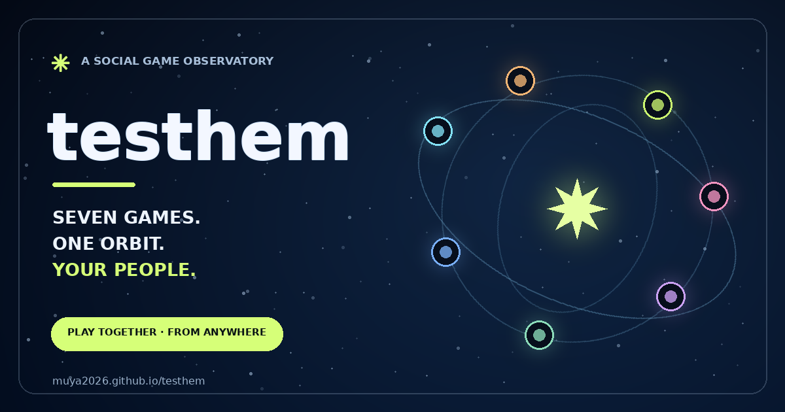

<div align="center">



# ✳ testhem

### Your group chat, but it escaped into space.

Seven social games orbit a tiny 3D observatory. Bring your best bluff, your worst prediction, and at least one friend who will absolutely call you out.

[](https://muya2026.github.io/testhem/)
[](#launch-sequence)

**A project by [@muya2026](https://github.com/muya2026)** · [Rules of the universe](#the-seven-portals) · [Supabase launch guide](SUPABASE_SETUP.md)

</div>

---

## Mission briefing

This is a party game that feels like a place. Drift around the camera-controlled 3D observatory, pick a portal, and play on one device—or open a private room so your crew can join from anywhere.

- **Local orbit:** 2–8 people, one device, pass it around.
- **Remote orbit:** each player joins the same private room from their own phone or computer.
- **Consent orbit:** prompts are optional, passing is always allowed, and The Trashbin only publishes a mark after someone explicitly agrees.

**Controls:** drag to look · WASD / arrow keys to move · choose a portal to launch. Prefer teleportation? Click **Choose a Game**.

## The seven portals

| Portal | What happens in there |
|---|---|
| 🫥 **Psych! The Truth Bluff** | Give a real answer or a very convincing lie. Everyone else decides which is which. Bluffers score for every friend they fool. |
| 🎭 **Two Truths & a Lie** | Write three claims, secretly mark the lie, and watch your friends build wildly incorrect theories. |
| ↔️ **Would You Rather?** | Pick between two impossible options, defend your choice, then see who knows you best. |
| ⁉️ **Three Questions** | Answer three quick questions—two honestly, one with an invented answer. Can anyone spot the fake? |
| 🫙 **Question Jar** | Draw a question, share only what feels comfortable, or pass. Vote for the answer that stays with you. |
| 🕵️ **Hidden Truth** | Leave one harmless real fact without your name. Your crew plays detective and guesses the author. |
| 🧭 **Read the Room** | Make a private A/B choice, predict the group's majority, and find out whether your social radar works. |

These are conversation games, not personality tests or diagnoses. Keep it kind; keep it comfortable.

## Launch sequence

### Open the live observatory

**[muya2026.github.io/testhem](https://muya2026.github.io/testhem/)** — no install and no account needed for same-device games.

### Run locally

```bash
python3 -m http.server 8000 --bind 0.0.0.0
```

Open `http://localhost:8000`. No bundler, package install, or build step; just HTML, CSS, JavaScript, and WebGL stardust.

### Light up online rooms

For a fresh Supabase project, follow the click-by-click [`SUPABASE_SETUP.md`](SUPABASE_SETUP.md): run [`supabase-schema.sql`](supabase-schema.sql), copy the Project URL and browser-safe publishable key into [`config.js`](config.js), then deploy. Choose a portal → **Far Apart** → create a room → send the private invite to your crew.

**Keep keys safe:** `sb_publishable_...` is designed for browser apps. Never place an `sb_secret_...`, `service_role` key, or database password in this repo.

## Keep the receipt 📸

At the end of a round, tap **Make a Branded Scorecard PNG**. The downloadable/shareable image includes the game, player names, scores, testhem branding, and the live URL—**not the private answers**. Give it a once-over before posting if your crew uses personal nicknames.

## The Trashbin 🗑️✨

A tiny public wall for visitor marks. Opening the wall does not post anything. A name and short note become public **only after the visitor submits and checks the consent box**. No email or account is collected. Leave contact details out of the bin.

## Small print from mission control

- Hosted as a static GitHub Pages site from `main` / repository root.
- Seven local modes and seven remote modes; Supabase is used for online rooms and the opt-in public mark wall.
- `assets/testhem-favicon.svg` is the site icon. `assets/testhem-social.png` is the 1200 × 630 Open Graph / Twitter preview image.
- Player names and game answers are stored in a remote room while that game is in progress. Local play stays in the browser.
- No geolocation is requested. The procedural sky is a mood, not an astronomical forecast.

## Credits

**Created by [@muya2026](https://github.com/muya2026).** The testhem name, observatory concept, game flow, interface, and custom social artwork are part of this project. The seven game worlds are built for curious crews; no outside game publisher is implied.

---

<div align="center">

**Stay curious. Be kind. Pass whenever.**  
[GPL-3.0](LICENSE) · [Issues](https://github.com/muya2026/testhem/issues) · [Project](https://github.com/muya2026/testhem)

</div>
