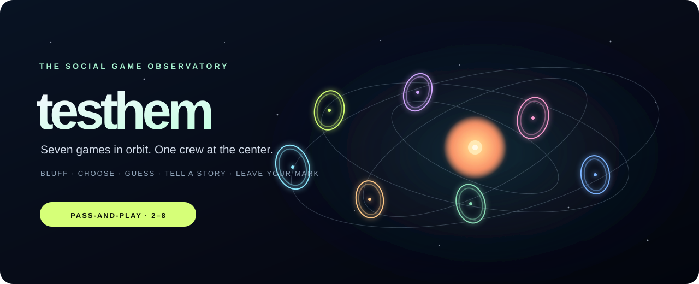

<div align="center">



# testhem

### Seven games. One orbit. Your people.

A tiny social universe for the stories, bluffs, wild guesses, and inside jokes that happen when your crew presses **play**.

[](https://muya2026.github.io/testhem/)

[](https://github.com/muya2026/testhem/deployments)
[](LICENSE)
[](#launch-it)

**Made by [@muya2026](https://github.com/muya2026)** · [Launch the live game](https://muya2026.github.io/testhem/)

</div>

---

## Welcome to the orbit

This is a party game that feels like a place. Look around a camera-navigable 3D observatory, pick one of seven glowing portals, and see what your friends will admit to, invent, or confidently get wrong.

**Around one device?** Pick *Same Room* and pass it along.  
**Across town—or across time zones?** Choose *Far Apart*, open a private Supabase room, and send the invite link. **Every game mode works in remote rooms.** No account or app install for players.

> **Quick controls:** drag to look around · WASD or arrow keys to move · select a portal to launch a game. If you prefer the direct route, use **Choose a Game**.

## Pick your portal

| Portal | The mission |
|---|---|
| **Psych! The Truth Bluff** | Tell the truth or sell a bluff. Can your crew read the difference? |
| **Two Truths & a Lie** | Three claims. One lie. A room full of amateur detectives. |
| **Would You Rather?** | Pick a side, defend it, then see who knows your orbit. |
| **Three Questions** | Answer three questions—honestly, except for one. Spot the fake. |
| **Question Jar** | Draw a question, share only what feels okay, and vote for the story that stays with you. |
| **Hidden Truth** | Leave one harmless real fact. Guess who put it in the universe. |
| **Read the Room** | Make a private pick. Then predict where the group will land. |

Every game has optional prompts and a **pass** button. These are conversation starters—not personality tests, diagnoses, or invitations to overshare. Keep it kind; keep it comfortable.

## Launch it

### Play the hosted version

Open **[muya2026.github.io/testhem](https://muya2026.github.io/testhem/)**. The observatory and same-device games work without Supabase. Remote rooms and **The Trashbin** need a Supabase project connected in `config.js`.

### Run it on your own machine

```bash
python3 -m http.server 8000 --bind 0.0.0.0
```

Then visit `http://localhost:8000`. No package install, bundler, or build command. It is plain HTML, CSS, JavaScript, and a little WebGL stardust.

### Turn on remote rooms

For a new Supabase project, run [`supabase-schema.sql`](supabase-schema.sql) once in **SQL Editor**. Put its **Project URL** and **publishable** (`sb_publishable_...`) key in [`config.js`](config.js), then publish the site. Choose a game → **Far Apart** → create a room → copy the private invite link. Friends can join from their own devices.

**Key safety:** publishable keys are intended for browser use. Never put an `sb_secret_...` or `service_role` key in this project. Room links contain a private bearer key; share them only with players.

## The Trashbin 🗑️✨

An opt-in public wall for tiny marks left by passing visitors. Nothing is posted just by opening the page: choose a display name, write a short mark, and affirm the public-visibility consent. Marks are visible to anyone who visits. No email or account is collected. Please skip contact details and anything you would not want displayed publicly.

The mark wall is included in `supabase-schema.sql` and is optional; local games do not depend on it.

## Build notes (there is no build)

- Static GitHub Pages deployment from `main` / repository root.
- `index.html`, `style.css`, `app.js`, and `config.js` are the whole app; `assets/` holds the art.
- Seven local modes and seven remote modes; no sign-in required.
- Supabase stores online room state and opt-in public marks. Local play stays in the browser.
- The little welcome star is not tracking you. The site does not request geolocation; the sky is atmosphere, not an astronomical forecast.

## Repository settings

Suggested About description: `A living 3D party-game observatory: seven social games, orbiting portals, local and cross-device play, and an opt-in public mark wall.`

Website: `https://muya2026.github.io/testhem/` · Topics: `party-games`, `social-games`, `webgl`, `3d`, `supabase`, `github-pages`, `guestbook`, `javascript`.

---

<div align="center">

**Made for curious crews.**  
[GPL-3.0](LICENSE) · [Open an issue](https://github.com/muya2026/testhem/issues) · [Meet the author](https://github.com/muya2026)

</div>
